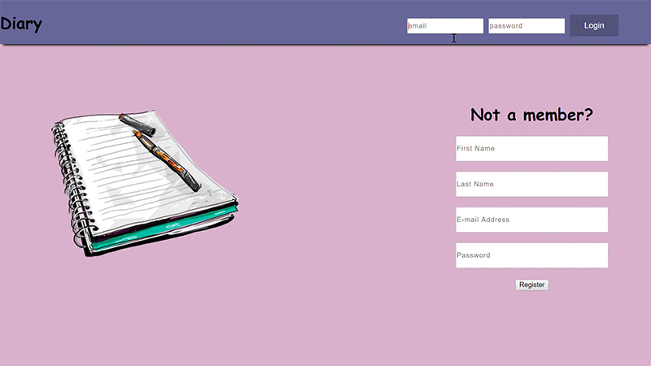
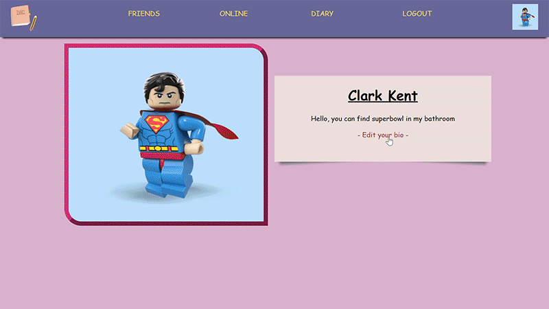
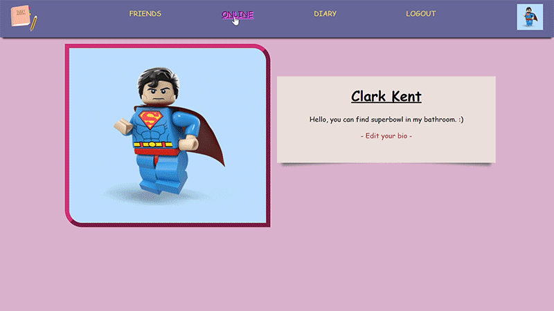
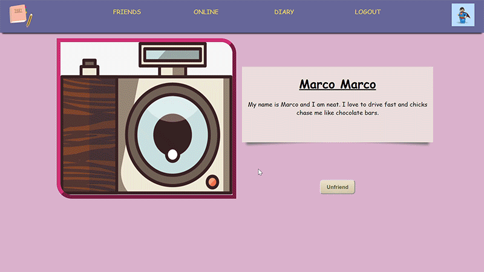
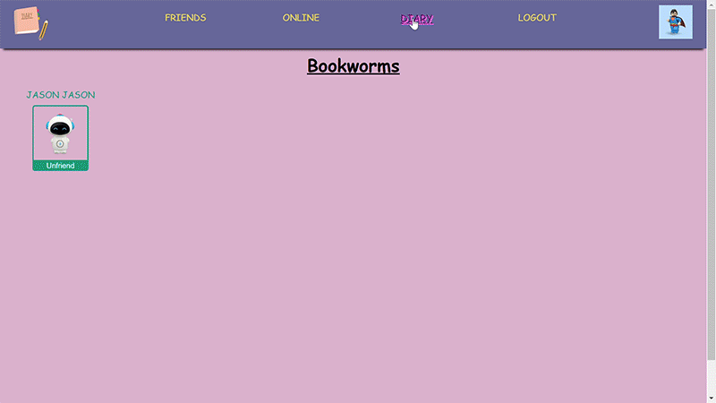

# SOCIAL NETWORK = CHECK SCREENSHOTS

### Table of contents

*   [Overview](#overview)
*   [Features](#features)
*   [Demo](#demo)

### Overview

Diary is a Full-Stack Social Networking app where you can register and log-in.  
Once registered you can start to make friends and change your bio and add profile picture. 
The name diary is in reference to the feature that you can share your experience to your friends 
by adding your story and publishing it.
Technologies used:
*   React
*   Redux
*   PostgreSQL
*   Node/Express
*   Amazon s3
*   SocketIO

### Features

-Login/Register
-Add Friends
-See Who's Online
-Add Bio and Images
-Write diaries which every registered users can see

### Demo

 
 

 
 

 
 

 
 

